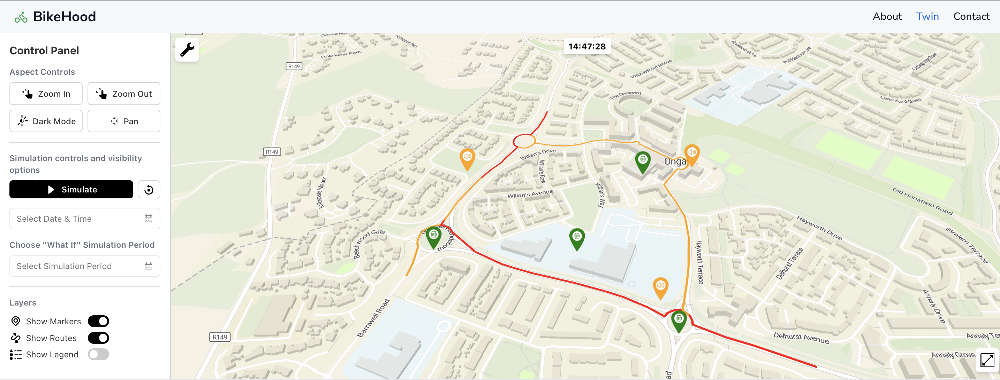
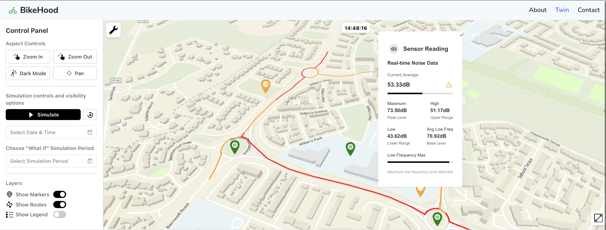
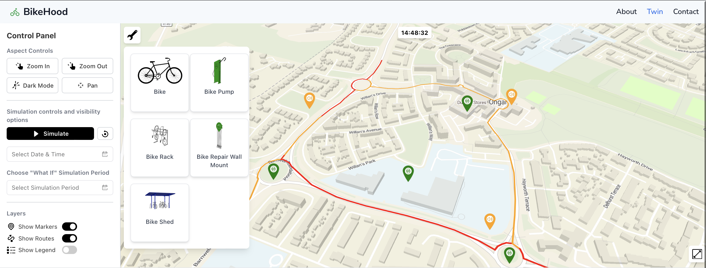
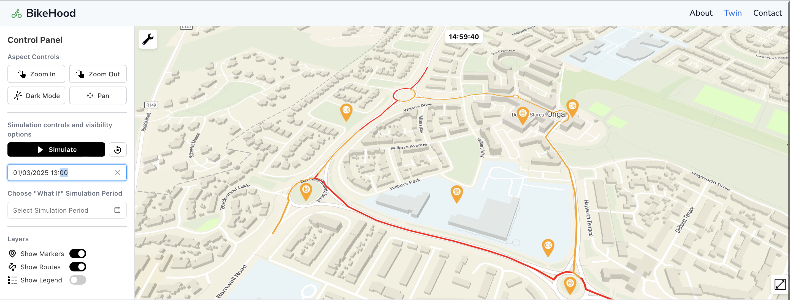
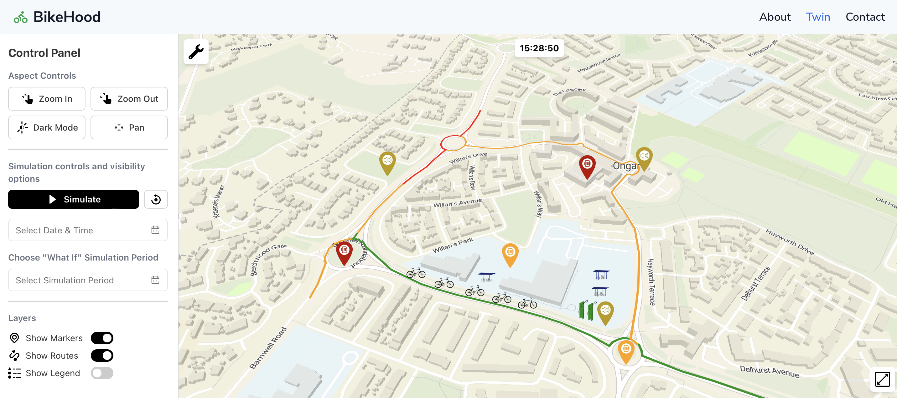
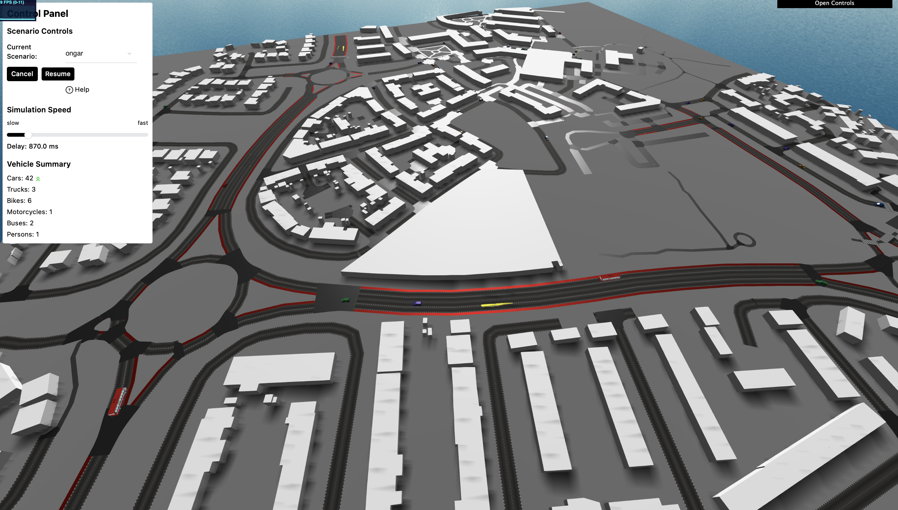
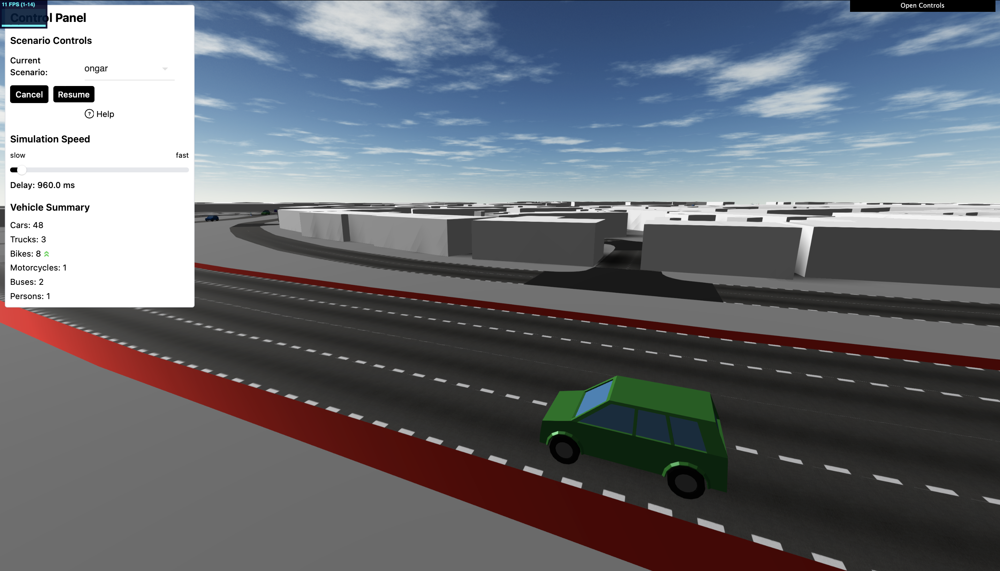

# BikeHood

BikeHood aims to to create Ireland's first cycling neighborhood. It aims to transform communities by promoting cycling and walking while enhancing infrastructure to tackle traffic congestion, pollution, and inequality.

This repository contains the digital twin prototype for the BikeHood project, which employs a novel approach that integrates key principles, such as digital twin technology and real time data collection.

BikeHood seeks to overcome current barriers to cycling adoption, such as inadequate infrastructure and the lack of incentives for sustainable transport. 

This digital twin captures the spatial and temporal dynamics of cycling, pedestrian, and transport infrastructure, permitting infrastructure scenario modeling to contribute to sustainable urban planning. 

The focus area during the prototype phase of the twin aims to capture these dynamics in Ongar, Co.Dublin. 


## Project Structure

```bash
BikeHood/
├── README.md               # Instructions 
├── client/                 # Frontend client application
├── docker-compose.yaml     # Docker configuration 
├── flask/                  # Flask backend server
└── sumo-web3d-tool/        # Third party 3D visualisation tool for SUMO simulations
``` 

## Prerequisites
To run the tool, you'll need:

- Docker and Docker Compose
- A modern web browser that supports WebGL (for 3D visualisation)

All other dependencies are handled by Docker.

## Installation

Clone the repository:

```bash
git clone https://github.com/TadghPurcell/BikeHood.git
cd BikeHood
```

# Running the Application

Start all services using Docker Compose:

```bash
docker-compose up
```

Access the web interface at http://localhost:5173

The docker-compose.yaml orchestrates all services:
- Flask backend server
- Client frontend application
- SUMO Web3D visualisation tool

All components have their own Dockerfiles in their respective directories.

## Environment Variables

Both the **client** and **Flask** services require environment variables. Make sure to create the following \`.env\` files **before** running Docker Compose.

### Client Environment Variables

In the ```client``` directory, create a file named `.env` with the following contents:

```bash
VITE_API_URL=http://localhost:8080 
VITE_MAPTILER_URL=https://api.maptiler.com/maps/fd917a1c-ab01-430c-852f-43a3629426b9/style.json

# Also need your API key here 
VITE_MAPTILER_API_KEY=

# As well as traffic key
VITE_TOMTOM_API_KEY=
VITE_API_BASE_URL=//localhost:8080
```

### Flask Environment Variables

In the `flask` directory, create a file named `.env` with the following contents:

```bash
# The DB username
DB_USERNAME=''

# The DB password
DB_PASSWORD=''

# The DB host
DB_HOST=''

# The DB port
DB_PORT=''

# The DB name
DB_NAME=''

# SK by Flask 
SECRET_KEY=''
FLASK_ENV='development'
DEBUG='True'

DB_SSLMODE=disable

# You will need Air Quality API key
AQI_TOKEN='' 
# As well as a Weather Forecast API key
FORECAST_API_KEY=''
# And finally a TomTom API key
TOMTOM_API_KEY=''
```

## Feature Overview
BikeHood enables bespoke urban mobility simulation and analysis, the focus being on bicycle infrastructure.

## Traffic Simulation
BikeHood integrates [SUMO](https://eclipse.dev/sumo/) (Simulation of Urban MObility) as well as [SUMO-Web3d](https://github.com/sidewalklabs/sumo-web3d) to provide detailed traffic simulations including:

- Multi-modal traffic flows (cars, bicycles, pedestrians)
- Custom traffic demand patterns
- Infrastructure modification and testing
- Time-based simulations with varying conditions

## 2D Visualisation Interface
The 2D interface provides a top-down view of the simulation, allowing for quick analysis and interaction:
Key 2D features:

- **Real-time traffic congestion visualisation for the Ongar area.** 

- **Markers which relay real-time information in regards to weather, air quality and noise data.** 

- **Interactive infrastructure editing tools.** 

- **Ability to view historic traffic and environmental metrics in relation to the area.** 

- **Simulate static scenarios based on the addition of cycling infrastructure to the area.** 

## 3D Visualization Interface
The 3D interface offers an immersive view of the simulated environment:
Key 3D features:

- **Realistic urban environment rendering of Ongar.** 

- **First-person and bird's-eye view options.** 

- **Animated vehicles and pedestrians.** 

- **Visual analysis of sight lines and street-level experience.**

- **Ability to alter simulation in real-time based on interaction with 2d interface.** 

- **Simulate dynamic scenarios based on the addition of cycling infrastructure to the area.** 

- **Switch to custom scenarios based on time and date to reflect real world dynamics based on such factors.** 